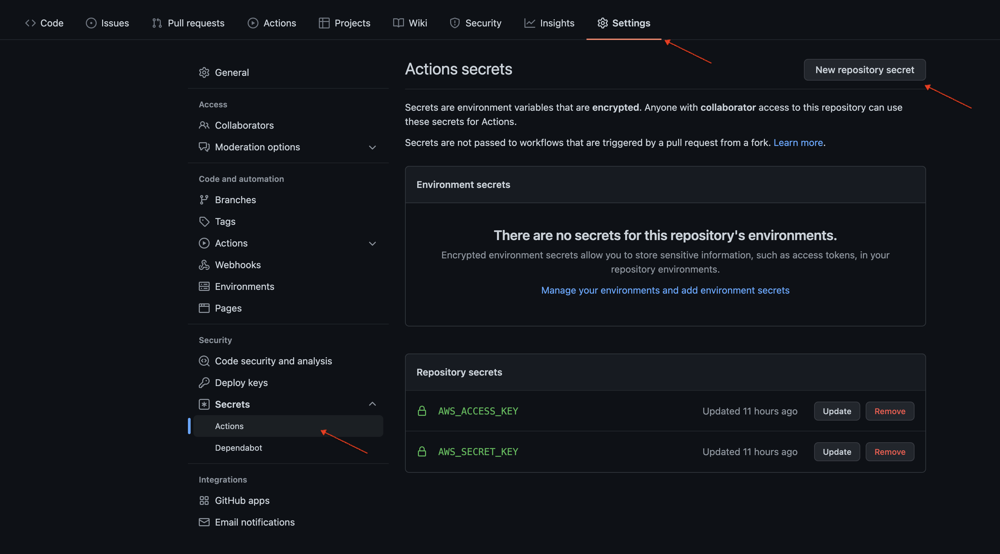

# Deploying a Node.js application to AWS Elastic Beanstalk using Github actions

Find `main.yml` file in `.github/workflows` folder.

### Used env variables

```
  S3_BUCKET_NAME            : "nodejs-servers"
  EB_APPLICATION_NAME       : "SimpleNodejsServer"
  EB_ENVIRONMENT_NAME       : "Simplenodejsserver-env"
  DEPLOY_PACKAGE_NAME       : "simple_nodejs_server_${{ github.sha }}.zip"
```

You can replace these values with yours.

`S3_BUCKET_NAME` is your AWS S3 bucket name where should be uploaded zip files. Bucket should be created in advance.

[How to create S3 bucket?](https://docs.aws.amazon.com/AmazonS3/latest/userguide/creating-bucket.html)

`EB_APPLICATION_NAME` is your AWS Elastic Beanstalk application name. It should be created in advance.

### Secrets

`AWS_ACCESS_KEY` and  `AWS_SECRET_KEY` should be added as the secrets with the values of your AWS user's access and secret keys. AWS user should have accesses to the AWS S3 and AWS Elastic Beanstalk.

[How to create AWS Elastic Beanstalk](https://docs.aws.amazon.com/elasticbeanstalk/latest/dg/applications.html)

##### How to add secrets?


